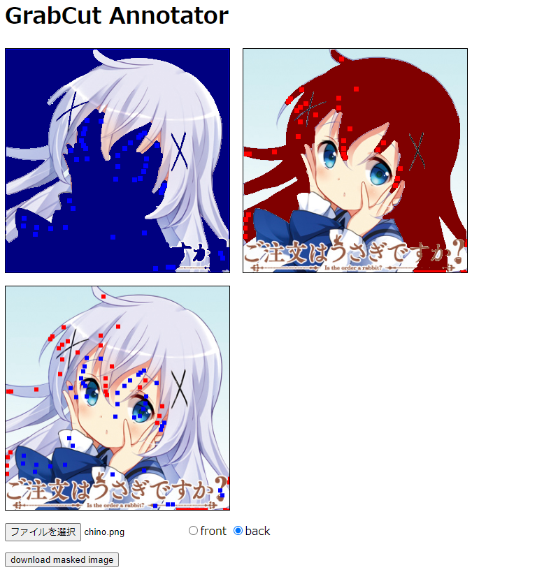

GrabCut Annotator
====

1. upload image
2. annotate frontground / backgound points
3. download masked image

This sample image is from http://www.gochiusa.com/news/hp0001/index00040000.html

This uses [OpenCV](https://github.com/opencv/opencv).js 4.5.1 (Apache 2.0)